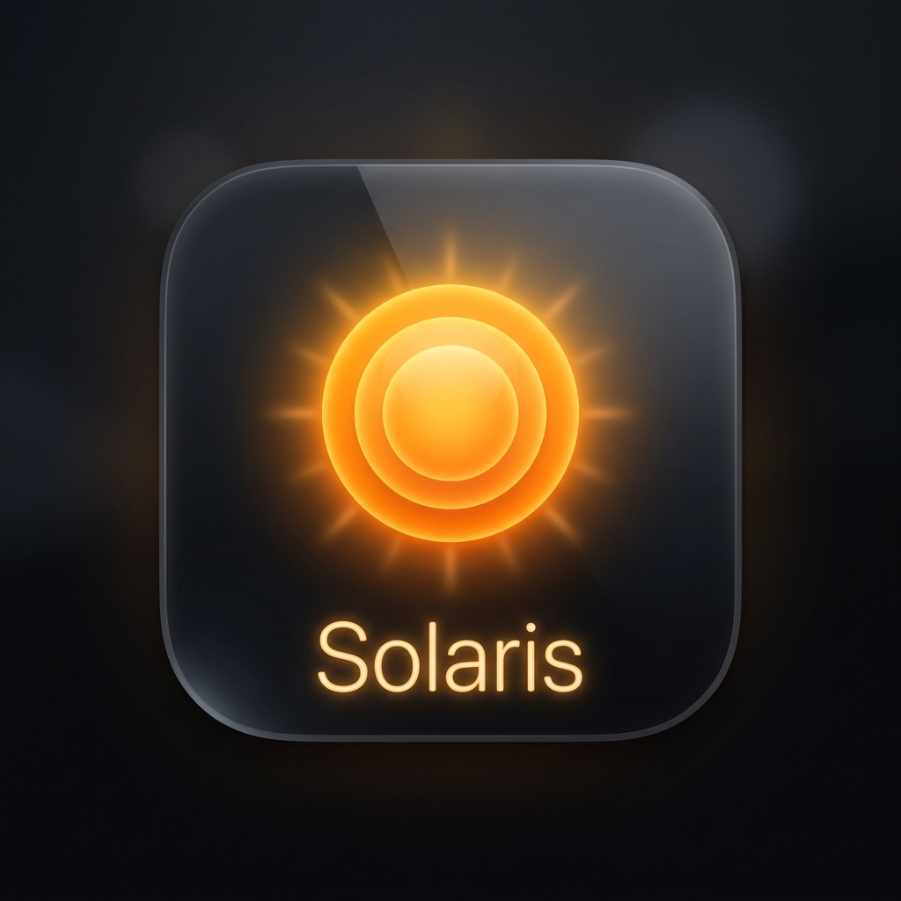
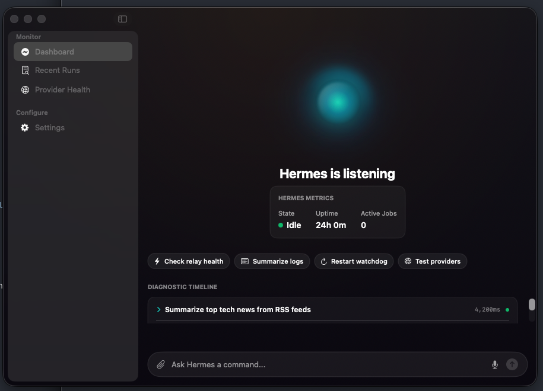
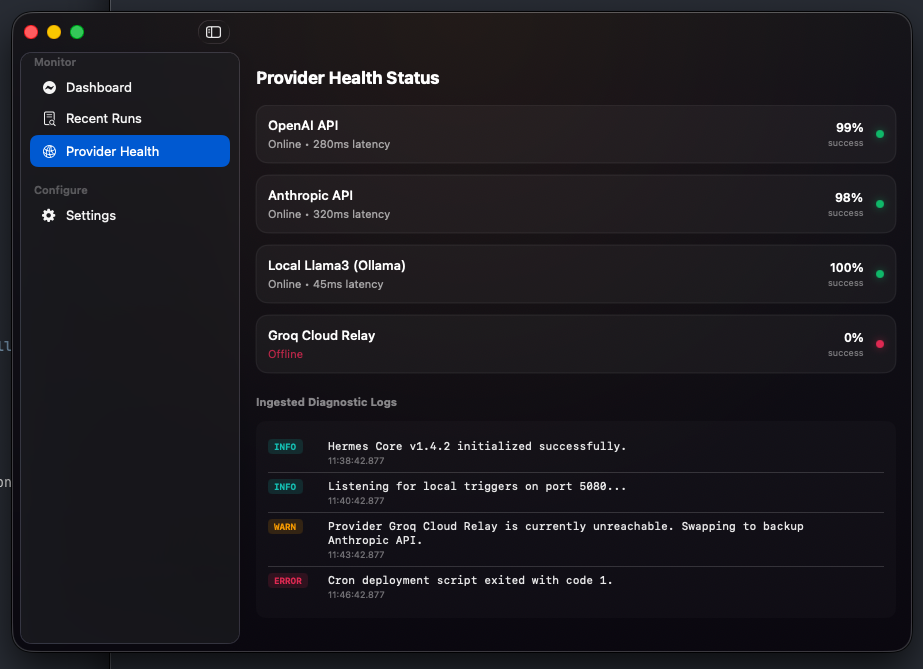
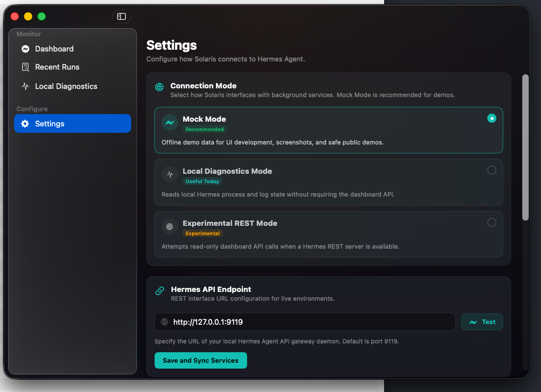
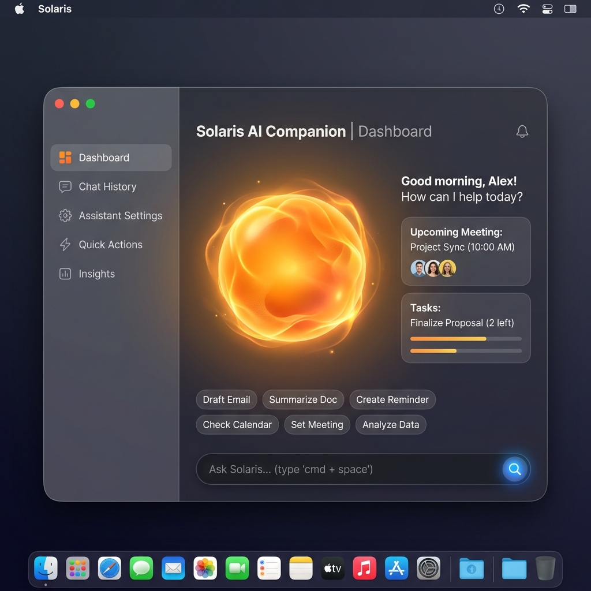
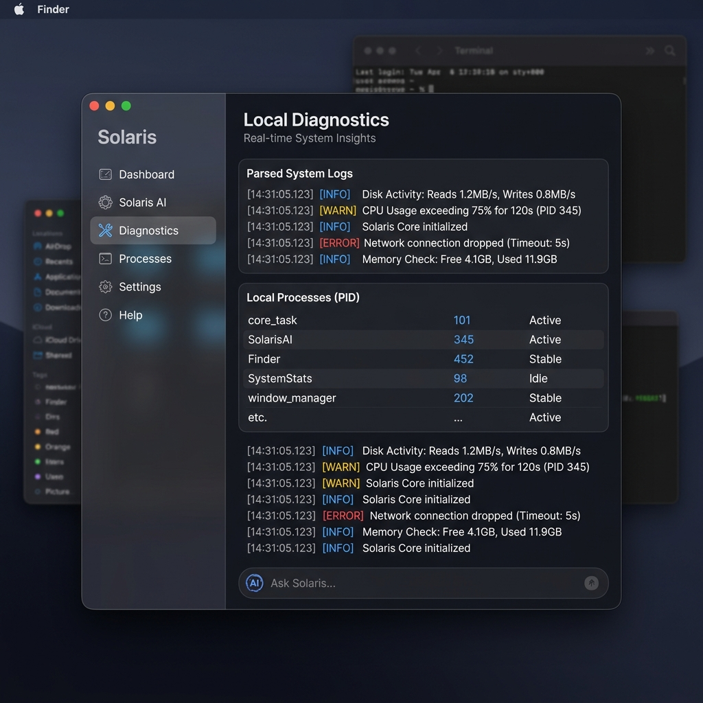
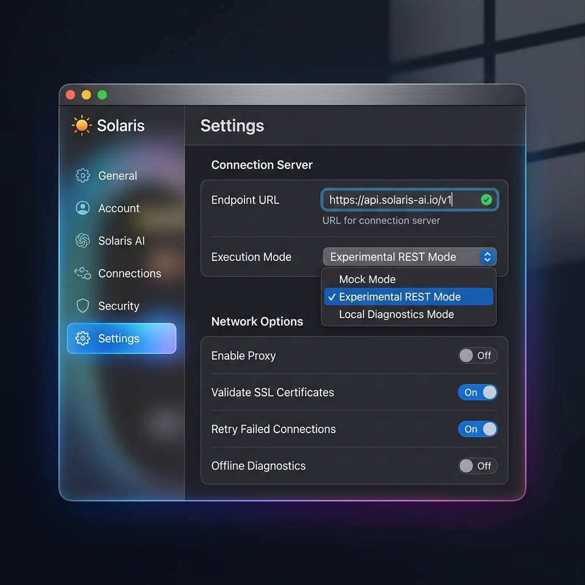

# Solaris ☄️

<p align="center">
  
</p>

Solaris is a native macOS companion/control surface for Hermes Agent.

It includes a polished mock mode, local diagnostics for Hermes process/log visibility, and an experimental read-only REST adapter for future Hermes dashboard API support. Inspired by native macOS assistant designs, it provides soft glassmorphism, responsive diagnostic visualizations, and low-latency interaction cards to control your local workflows.

[](https://github.com/davidnyuwin/solaris/actions/workflows/ci.yml)


---

## 🎨 Visual Design & Inspiration

Solaris is built as a **desktop control panel** rather than a generic chat shell:
- **Abstract Ambient Orb**: A glowing, breathing SwiftUI canvas visualizing the current Hermes state (*listening, processing, speaking, or error*).
- **Glassmorphic Sidebar**: Translucent macOS native material listing active hosts, connections, and health configurations.
- **Structured Cards**: Distinct responsive tiles displaying provider latency metrics, parsed error logs, and execution summaries.
- **Capsule Command Bar**: Quick bottom command bar with micro-actions and attachment slots.

### 📸 Runtime Preview

These are actual runtime screenshots captured from Solaris v0.2.0.

| Dashboard | Local Diagnostics | Settings |
| :---: | :---: | :---: |
|  |  |  |

---

### 🎨 Concept Direction

These concept images represent the original visual direction and are retained for design history only.

| Dashboard Mockup | Local Diagnostics Mockup | Settings Mockup |
| :---: | :---: | :---: |
|  |  |  |

---

## ⚙️ Architecture

The app is structured strictly around **MVVM (Model-View-ViewModel)** and uses Swift concurrency (`async/await`) and service protocols.

```text
Sources/HermesCompanion/
  ├── App/             # @main App Entry Point
  ├── Views/           # NavigationSplitView and full pages (Dashboard, Settings, etc.)
  ├── Components/      # Animated Orb, Cards (Provider, Log, Result, CommandBar)
  ├── Models/          # Plain struct schemas (HermesStatus, ProviderHealth, LogLine)
  ├── ViewModels/      # Main UI state controller handling commands & action signals
  └── Services/        # Protocol-defined network adapters (Mock & Production API pathways)
```

---

## 🚀 Getting Started

### Prerequisites
- macOS 14.0 or newer.
- Xcode 15.0+ or command-line Swift toolchain.

### Build and Run with Terminal
To clone and run immediately from your macOS shell:
```bash
# Clone the repository
git clone https://github.com/your-username/solaris.git
cd solaris

# Compile and run the app
swift run
```

### Run Tests
If your local toolchain is connected to a full Xcode app bundle, you can execute standard unit tests:
```bash
swift test
```

---

## 🔌 Connection Map: Three Service Integration Modes

The app uses a `DynamicHermesService` orchestrator that switches the underlying integration engine dynamically depending on your choice in the in-app **Settings**:

1.  **Mock Mode (Default):** Safely isolated inside a local Swift actor (`MockHermesService`) for offline design iterations and public demos. Returns beautiful, realistic simulated metrics, active timeline logs, and quick actions.
2.  **Experimental REST Mode:** Connects to the local web server endpoint on `http://127.0.0.1:9119` using `LiveHermesService`. Fully mapped and validated against the Hermes Studio daemon code, but currently offline due to missing server-side dependencies (`fastapi` / `uvicorn`) in this local installation.
3.  **Local Diagnostics Mode:** A completely offline, non-network diagnostic scanner (`LocalHermesDiagnosticsService`). It leverages safe shell process inspection (`pgrep`/`ps`) and filesystem scanning to discover if the background gateway daemon is running, inspects `lsof` to scan port listeners, and directly reads and tokenizes live logging from `~/.hermes/logs/agent.log` and `~/.hermes/logs/gateway.log`. In v0.4.0, it is enriched with safe, read-only Hermes CLI status checks (active provider, active model, gateway service status, and recent gateway events) using non-shell Swift `Process` executions.

> [!IMPORTANT]
> **Release Safeguards & Privacy:**
> *   **Safe Public Demos:** **Mock Mode** operates completely offline inside a Swift actor without executing process checks or scanning filesystem files, making it the safest option for public video demonstrations, screenshots, or slides.
> *   **No Credentials Required:** The companion app operates completely locally. It **never requests, stores, or transmits** any third-party API keys, bearer tokens, or user passwords.
> *   **Diagnostics Isolation:** All logs and process diagnostics are retrieved using safe local system mechanisms and are kept strictly local to your machine. No telemetry is collected or reported.

---

## 🔍 Diagnostic Testing & Smoke Tests

To verify endpoint connectivity without relying on standard unit test compilations, a lightweight bash test utility is provided:

```bash
# Execute local REST endpoint probes
./scripts/smoke-test.sh
```

### ⚠️ Phase 1 Boundaries & Technical Limitations
*   **No Confirmed Live Command/Control:** The app does **not** currently provide confirmed live command/control over Hermes. Full WebSocket, chat, and command transports are future work.
*   **Local Web Server Offline:** In this local Hermes Studio installation, the dashboard API is **unavailable** because the required backend libraries (`FastAPI` and `Uvicorn`) are not packaged in the bundled python resource directory.
*   **Experimental REST Mode:** Requires a running Hermes dashboard API on localhost. Because port `9119` is unlistening at runtime, the REST pathway remains offline by default.
*   **Mock Mode Default:** Mock Mode is the default and safest mode for public demos. It runs completely locally in memory with simulated data, requiring no external processes or permissions.
*   **Local Diagnostics Mode:** Safely reads local background process states and live logging records directly from the developer's machine (`~/.hermes/logs/agent.log` and `~/.hermes/logs/gateway.log`).
*   **No Credentials Required:** The current application operates entirely without requesting, storing, or requiring any API keys or tokens.
*   **Local Profiles Discovery:** Intentionally deferred at this stage. It has been evaluated in a robust security threat model under [profile-discovery-threat-model.md](docs/profile-discovery-threat-model.md) in v0.6 to enforce strict metadata whitelisting and path redacting protocols before any config parsing is implemented.
*   **Future Authentication Security:** Any future access tokens or authorization credentials must use the secure **macOS Keychain services API**, never in committed configuration files or UserDefaults.

## 📦 Local App Bundle

Solaris can be compiled, signed, and packaged into a standalone macOS `.app` bundle or local ZIP archive:

```bash
# Build the local unsigned app bundle
./scripts/build-app.sh

# Build, ad-hoc codesign, and package as a ZIP archive
./scripts/build-app.sh --sign --zip

# Open the app bundle from your terminal
open dist/Solaris.app
```

*Note: Ad-hoc signing is for local code integrity verification only. It is not notarized or signed with a Developer ID. For details on constraints, diagnostics, and sandboxing, see [packaging.md](docs/packaging.md).*

---

## 🗺️ Roadmap
- [ ] Polish visual identity and icon
- [ ] Add signed app bundle workflow
- [ ] Improve local diagnostics parsing
- [ ] Add optional REST dashboard support when available
- [ ] Investigate WebSocket/event stream support
- [ ] Add Keychain-backed credential storage if auth is ever required

## 📄 License
This project is licensed under the MIT License - see the LICENSE file for details.
